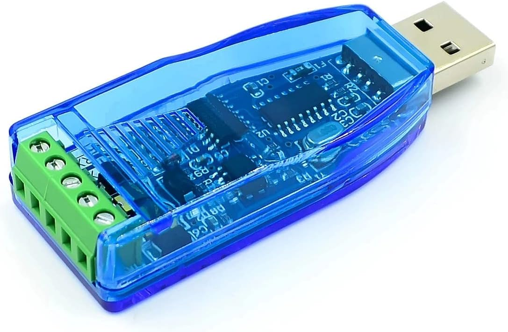
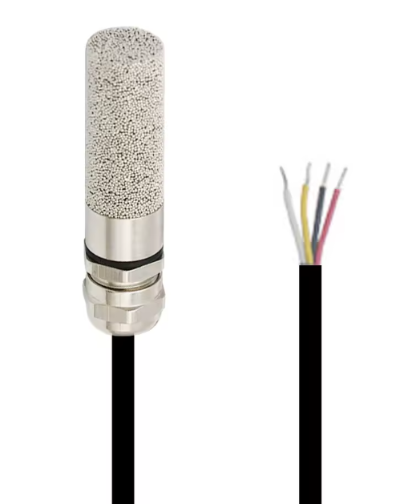

These scripts demonstrates the use of 5 SHT30 temperature and humidity sensors connected via Modbus RTU (RS485). Interfaced with an USB adapter connected to an Ubuntu desktop computer.

Tested with "JZK USB auf RS485 Konverter Adapter, kompatibel mit Windows 10, 8, 7, XP, Vista, Linux und Mac OS" (6,59€)
https://www.amazon.de/dp/B09SB85W3J

and the following sensor: "SHT30 Temperatur- und Feuchtigkeitssensor mit Kabel, wasserdicht, RS485-Ausgang, Standard-MODBUS-RTU-Protokoll, 1 m Länge, -40 bis +125" (Style C, 10.99€ per piece)
https://de.aliexpress.com/item/1005004705579055.html

